# RBAC 權限管理系統

本專案是一個基於角色與權限的使用者管理系統，包含使用者登入、角色與權限管理、表單提交與審核、通知功能等模組。

## 使用技術

### 後端技術：
- **Spring Boot**：作為主要後端框架，用來開發 API 和處理後端業務邏輯。
  1. **Interceptor 登入攔截**：
          - 配置 `HandlerInterceptor`，在進入控制器前檢查使用者是否已登入。
  2. **AOP 權限控制**：
     - 利用 `@Aspect` 和 `@Before` 注解，在 API 調用前進行權限檢查。
     - 根據使用者的角色或權限，決定是否允許訪問該 API。

- **MyBatis**：用於簡化資料庫操作，執行查詢、插入和更新等操作。
- **JWT（JSON Web Token）**：用來實作使用者登入及身份驗證，確保每次請求都能通過安全的身份驗證。
- **Swagger**：用於生成 API 文件及提供交互式接口測試，方便開發者和測試人員了解並測試 API。
- **reCAPTCHA 整合**：防止自動化機器人進行惡意註冊，確保系統安全性。
- **Gmail 發信功能**：使用 Gmail 的 SMTP 服務，當使用者註冊後自動發送確認郵件。

### 前端技術：
[🔗RBAC-frontend](https://github.com/Lulu1022/RBAC-frontend)
- 使用 Vue 3 開發前，支援動態權限控制。
- 使用 Element Plus 模板。

---
## 功能列表

| 🔧 功能名稱                         | 描述                                                                                                           | 🖼 圖片                                                                 |
|----------------------------------|--------------------------------------------------------------------------------------------------------------|--------------------------------------------------------------------|
| **1. 帳號註冊串接 reCAPTCHA 人機驗證、Gmail 發信功能** |
| 1.1 🤖【註冊帳號 reCAPTCHA 人機驗證】| 使用者註冊帳號。串接 reCAPTCHA 進行驗證，防止自動化機器人惡意註冊。| 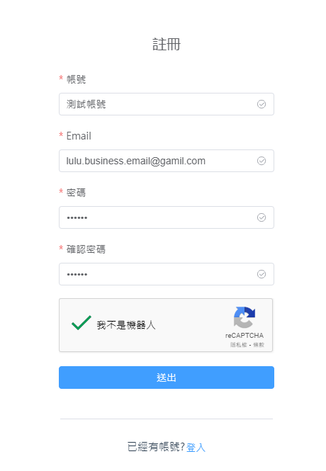|                                                                                    
| 1.2 ✉️【Gmail 通知信】| 註冊成功後發送通知信件| 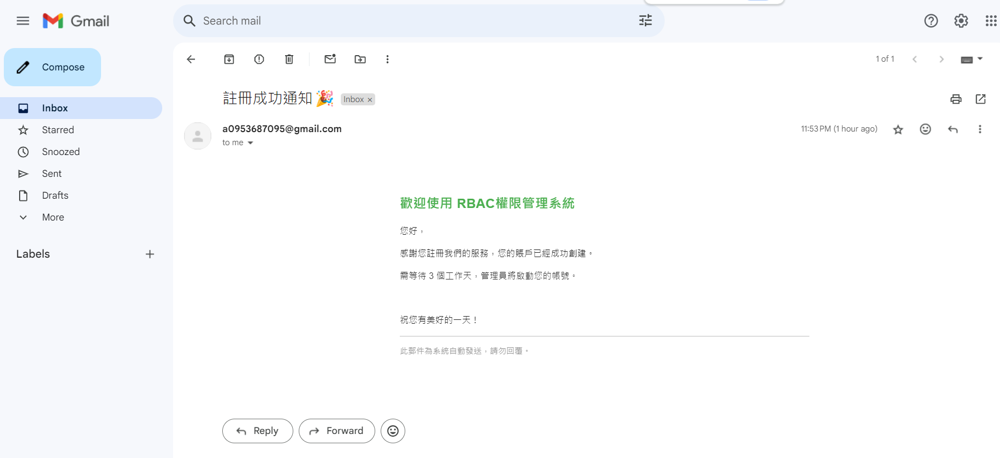                                  |
| **2. 使用者管理**                |
| 2.1 🔐【登入】                      | 使用者通過帳號和密碼登入系統，並使用 JWT 進行身份驗證，未攜帶 JWT 請求會被攔截                                 |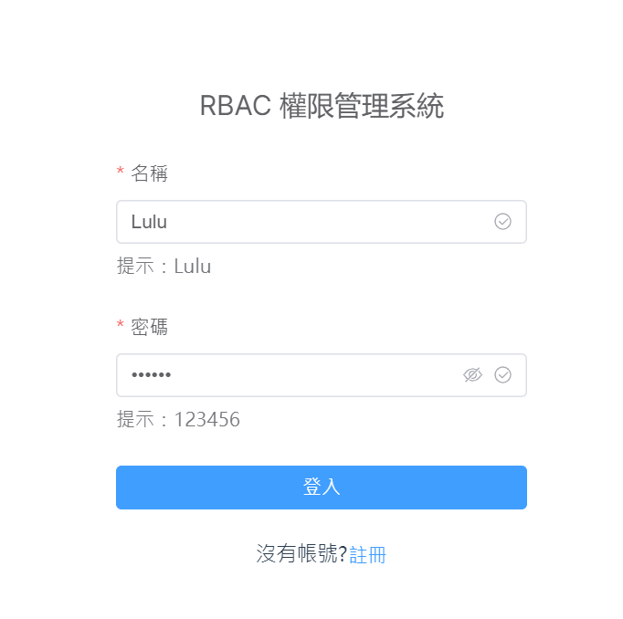|
| 2.2 ➕【新增使用者】                 | 管理者可以新增新使用者，並賦予不同的角色                                                                       | 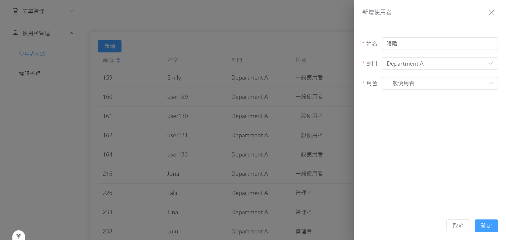                                  |
| 2.3 ✅【啟用或停用使用者】           | 可以啟用或停用特定使用者，被停用的使用者將無法登入系統                                                         | 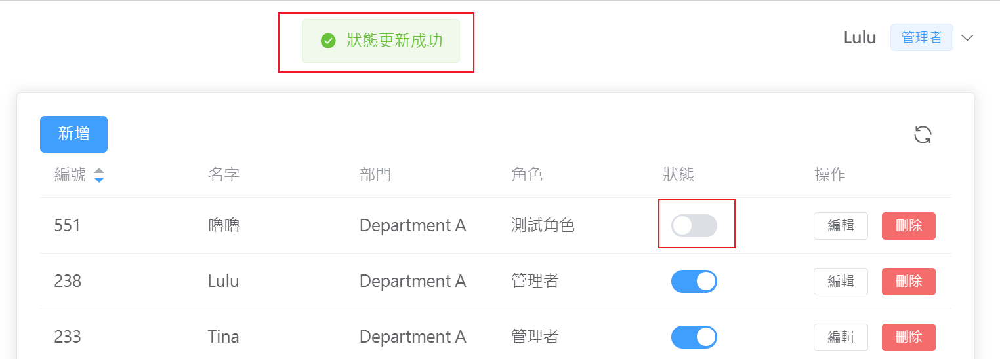 
   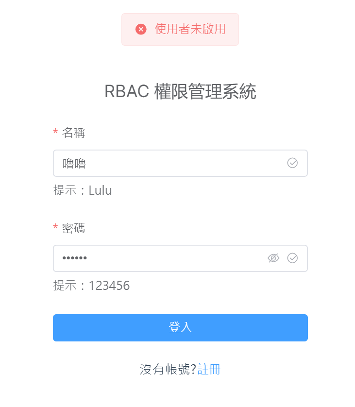|
| 2.4 🗑️【刪除使用者】                 | 管理者可以刪除不需要的使用者帳號                                                                               | 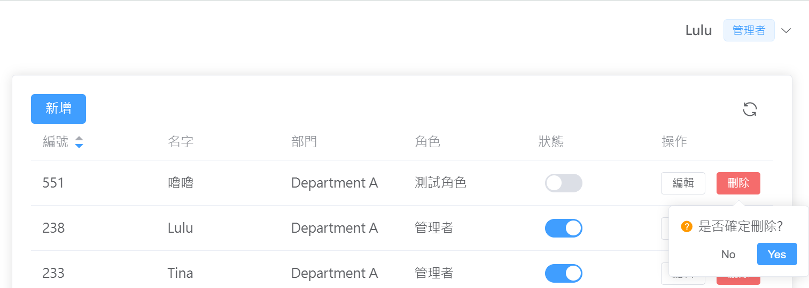 |
| **3. 角色與權限管理**            |
| 3.1 🛠️【新增角色，並賦予角色權限】   | 可以新增新的角色，並選擇賦予該角色特定的權限                                                                   | 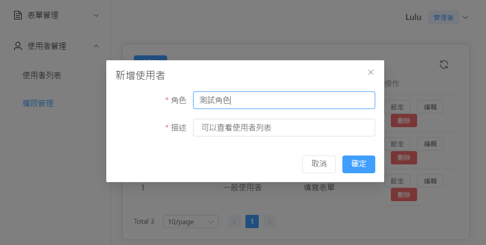                                    |
| 3.2 🧑‍💼【賦予使用者角色】             | 每位使用者僅能有一個角色，確保他們擁有執行指定操作的權限                                                       | 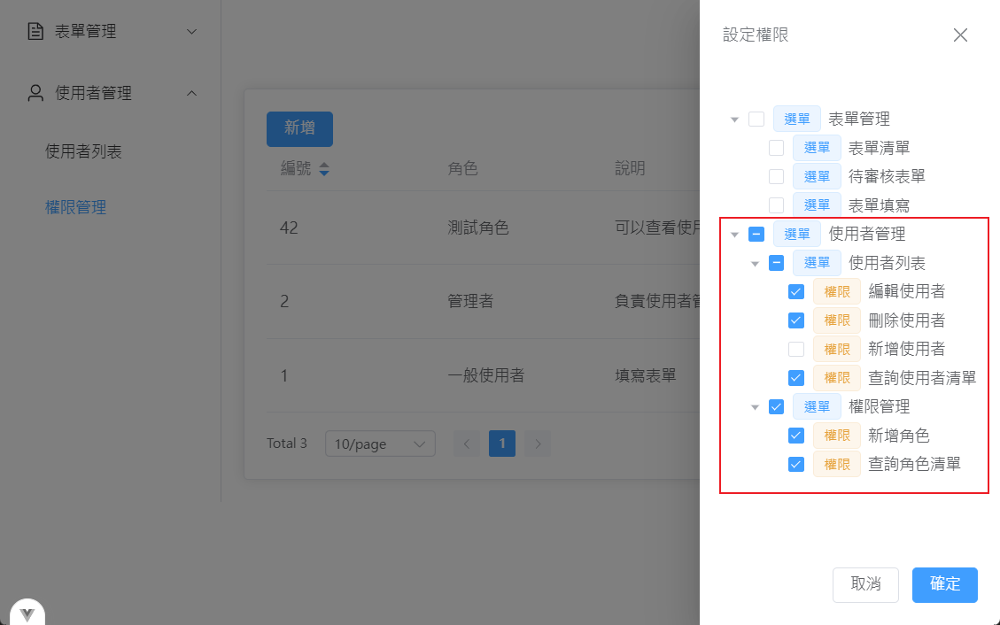 
   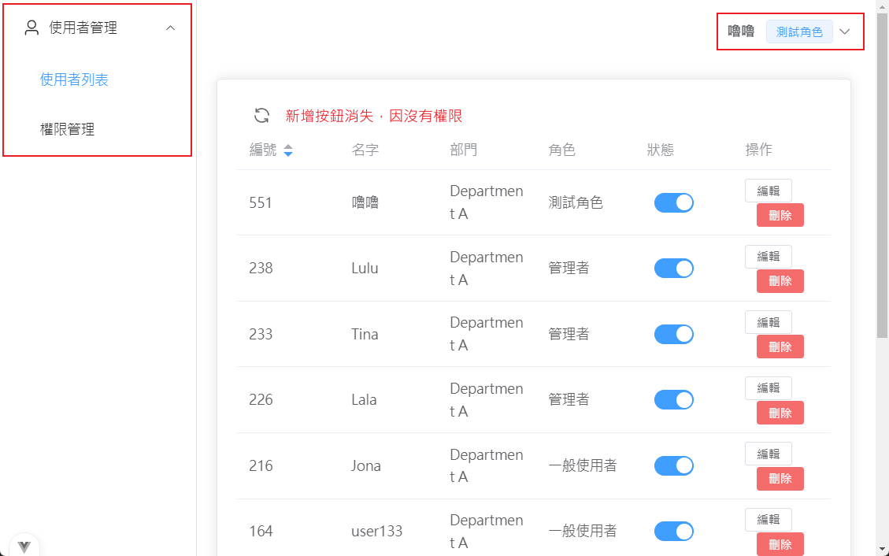 |
| 3.3 🚫【權限不足提醒】               | 輸入沒有權限的路徑，會出現權限不足提醒                                                                         | 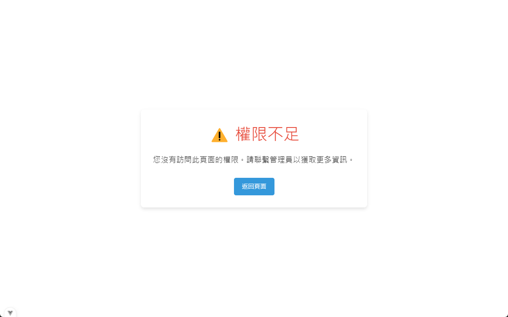                                |
| **4. 表單管理**                  |
| 4.1 📝【填寫並送出表單】             | 使用者可以填寫並提交新表單，表單將等待審核                                                                     | 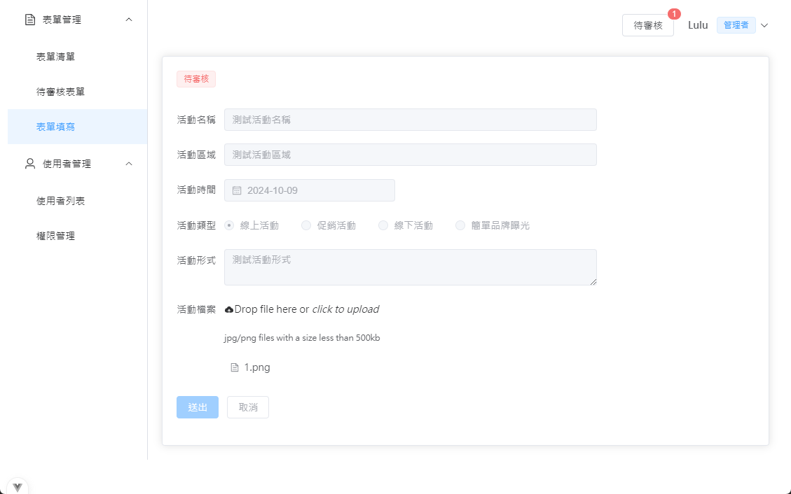|
| 4.2 ✅【審核表單】                   | 擁有審核表單權限的使用者可以查看並審核提交的表單                                                               | 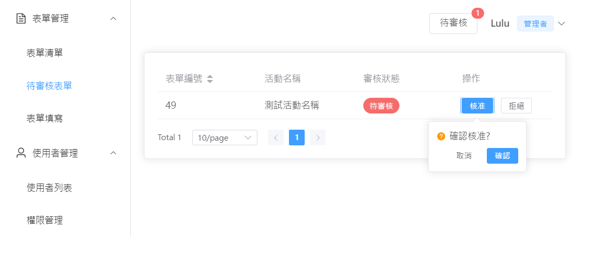  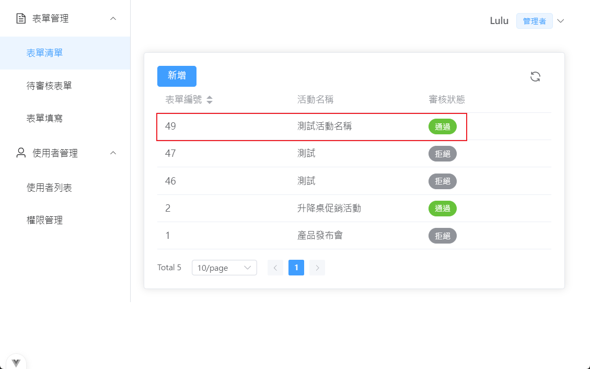 |

